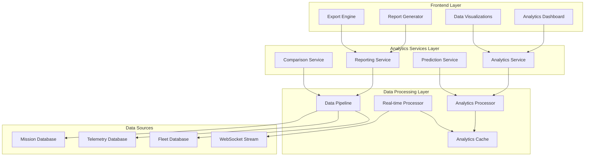

# Survey Analytics Portal Design Document

## Overview

The Survey Analytics Portal is a comprehensive reporting and analytics platform that transforms raw drone survey data into actionable insights. It provides multi-level analytics from individual mission performance to organization-wide strategic metrics, enabling data-driven decision making for drone operations management.

The system integrates seamlessly with the existing drone mission management platform, leveraging real-time telemetry data, mission records, and fleet information to generate sophisticated analytics dashboards, reports, and predictive insights.

## Architecture

### High-Level Architecture



### Component Architecture

The analytics system follows a layered architecture with clear separation of concerns:

1. **Presentation Layer**: React-based dashboard components with interactive visualizations
2. **Service Layer**: Analytics business logic and data aggregation services
3. **Processing Layer**: Data transformation, caching, and real-time processing
4. **Data Layer**: Integration with existing mission, telemetry, and fleet databases

## Components and Interfaces

### Analytics Service (`analytics.service.ts`)

**Purpose**: Core analytics engine responsible for data aggregation, calculation, and insight generation.

**Key Methods**:
```typescript
interface AnalyticsService {
  // Mission Analytics
  getMissionPerformanceMetrics(missionId: string): Promise<MissionMetrics>
  calculateCoverageEfficiency(missionId: string): Promise<number>
  generateMissionReport(missionId: string): Promise<MissionReport>
  
  // Fleet Analytics
  getFleetUtilization(timeRange: TimeRange): Promise<FleetUtilization>
  calculateMaintenanceSchedule(droneId: string): Promise<MaintenanceSchedule>
  identifyPerformanceAnomalies(): Promise<PerformanceAnomaly[]>
  
  // Organizational Analytics
  getOrganizationMetrics(timeRange: TimeRange): Promise<OrgMetrics>
  calculateCostAnalysis(timeRange: TimeRange): Promise<CostAnalysis>
  generateTrendAnalysis(metric: string, timeRange: TimeRange): Promise<TrendData>
}
```

### Reporting Service (`reporting.service.ts`)

**Purpose**: Handles report generation, export functionality, and executive summaries.

**Key Methods**:
```typescript
interface ReportingService {
  generateExecutiveSummary(timeRange: TimeRange): Promise<ExecutiveReport>
  exportMissionData(format: ExportFormat, filters: ReportFilters): Promise<Buffer>
  createCustomReport(template: ReportTemplate): Promise<CustomReport>
  schedulePeriodReport(schedule: ReportSchedule): Promise<void>
}
```

### Prediction Service (`prediction.service.ts`)

**Purpose**: Provides predictive analytics for maintenance, capacity planning, and performance forecasting.

**Key Methods**:
```typescript
interface PredictionService {
  predictMaintenanceNeeds(droneId: string): Promise<MaintenancePrediction>
  forecastCapacityRequirements(timeRange: TimeRange): Promise<CapacityForecast>
  analyzePerformanceTrends(metric: string): Promise<TrendPrediction>
  optimizeResourceAllocation(missions: Mission[]): Promise<AllocationSuggestion>
}
```

### Real-time Analytics Processor (`realtime-analytics.processor.ts`)

**Purpose**: Processes live telemetry data to provide real-time analytics updates.

**Key Methods**:
```typescript
interface RealtimeAnalyticsProcessor {
  processLiveTelemetry(telemetry: TelemetryData): Promise<void>
  updateMissionMetrics(missionId: string): Promise<LiveMetrics>
  generateLiveAlerts(thresholds: AlertThresholds): Promise<Alert[]>
  calculateLiveEfficiency(missionId: string): Promise<EfficiencyScore>
}
```

## Data Models

### Analytics Data Models

```typescript
interface MissionMetrics {
  missionId: string
  duration: number // minutes
  distanceCovered: number // kilometers
  areaSurveyed: number // square kilometers
  coverageEfficiency: number // percentage
  batteryConsumption: number // percentage
  averageSpeed: number // m/s
  averageAltitude: number // meters
  successRate: number // percentage
  qualityScore: number // 0-100
}

interface FleetUtilization {
  totalFlightHours: number
  averageMissionDuration: number
  fleetSuccessRate: number
  utilizationByDrone: DroneUtilization[]
  maintenanceAlerts: MaintenanceAlert[]
  performanceScores: PerformanceScore[]
}

interface OrgMetrics {
  totalSurveys: number
  totalAreaCovered: number // square kilometers
  totalFlightTime: number // hours
  costPerSurvey: number
  costPerArea: number // per square kilometer
  trendsData: TrendPoint[]
  seasonalPatterns: SeasonalData[]
}

interface CoverageAnalysis {
  plannedArea: number // square kilometers
  actualCoverage: number // square kilometers
  coveragePercentage: number
  gapAreas: GeoPolygon[]
  overlapEfficiency: number
  qualityScore: number
  recommendations: string[]
}
```

### Visualization Data Models

```typescript
interface ChartData {
  type: 'line' | 'bar' | 'pie' | 'scatter' | 'heatmap'
  data: DataPoint[]
  labels: string[]
  colors: string[]
  options: ChartOptions
}

interface DashboardWidget {
  id: string
  type: WidgetType
  title: string
  position: { x: number; y: number; width: number; height: number }
  config: WidgetConfig
  data: ChartData | MetricData
}

interface MetricCard {
  title: string
  value: number | string
  unit?: string
  trend?: TrendIndicator
  comparison?: ComparisonData
  status: 'good' | 'warning' | 'critical'
}
```

## Correctness Properties

*A property is a characteristic or behavior that should hold true across all valid executions of a system—essentially, a formal statement about what the system should do. Properties serve as the bridge between human-readable specifications and machine-verifiable correctness guarantees.*

### Property 1: Mission Analytics Accuracy
*For any* completed mission with telemetry data, the calculated performance metrics (duration, distance, coverage) should accurately reflect the actual mission execution data within acceptable tolerance ranges.
**Validates: Requirements 1.1, 1.2, 1.3**

### Property 2: Coverage Efficiency Calculation
*For any* mission with defined survey area and actual flight path, the coverage efficiency percentage should be calculated as (actual surveyed area / planned survey area) × 100, with proper handling of overlap areas.
**Validates: Requirements 1.3, 8.1**

### Property 3: Fleet Utilization Aggregation
*For any* time period and set of drones, the fleet utilization metrics should be the accurate sum/average of individual drone metrics, with no data loss or double-counting.
**Validates: Requirements 2.1, 2.2**

### Property 4: Real-time Metrics Consistency
*For any* active mission, real-time analytics updates should maintain consistency with historical data patterns and not show impossible values (e.g., negative progress, speed exceeding drone capabilities).
**Validates: Requirements 6.1, 6.2**

### Property 5: Organizational Metrics Aggregation
*For any* organization with multiple sites, the total organizational metrics should equal the sum of all site metrics, ensuring no data is lost or duplicated in aggregation.
**Validates: Requirements 3.1, 3.2**

### Property 6: Trend Analysis Accuracy
*For any* historical dataset, trend calculations should correctly identify patterns (increasing, decreasing, seasonal) and provide statistically valid projections based on the underlying data.
**Validates: Requirements 7.1, 7.2, 7.4**

### Property 7: Site Comparison Fairness
*For any* set of sites being compared, the ranking and performance metrics should be calculated using consistent methodologies and time periods, ensuring fair comparison.
**Validates: Requirements 4.1, 4.2**

### Property 8: Export Data Integrity
*For any* analytics report export, the exported data should exactly match the data displayed in the dashboard, with no formatting errors or data corruption across all supported formats.
**Validates: Requirements 3.5, 5.2**

### Property 9: Alert Generation Accuracy
*For any* drone or mission meeting defined threshold conditions, alerts should be generated consistently and contain accurate information about the triggering condition.
**Validates: Requirements 2.5, 6.3**

### Property 10: Coverage Gap Detection
*For any* survey mission, identified coverage gaps should represent actual areas not surveyed, and recommended flight paths should provide valid solutions to cover those gaps.
**Validates: Requirements 8.2, 8.3**

### Property 11: Predictive Analytics Validity
*For any* maintenance prediction or capacity forecast, the predictions should be based on valid statistical models and provide confidence intervals that reflect the uncertainty in the predictions.
**Validates: Requirements 5.3, 7.4**

### Property 12: Dashboard Widget Consistency
*For any* customizable dashboard configuration, widget data should remain consistent with the underlying analytics data and update correctly when filters or time ranges change.
**Validates: Requirements 5.1, 6.4**

## Error Handling

### Data Quality Validation
- **Missing Telemetry Data**: Gracefully handle missions with incomplete telemetry by clearly indicating data gaps and providing partial analytics where possible
- **Corrupted Data**: Implement data validation to detect and flag corrupted telemetry or mission data, preventing incorrect analytics
- **Time Zone Handling**: Ensure consistent time zone handling across all analytics, especially for multi-site organizations

### Performance Optimization
- **Large Dataset Handling**: Implement pagination and data streaming for large analytics queries to prevent timeout errors
- **Cache Management**: Use intelligent caching strategies to balance real-time accuracy with performance
- **Query Optimization**: Optimize database queries for analytics workloads, including proper indexing and query planning

### User Experience
- **Loading States**: Provide clear loading indicators for long-running analytics calculations
- **Error Recovery**: Allow users to retry failed operations and provide alternative data views when primary data is unavailable
- **Graceful Degradation**: Continue providing basic analytics even when advanced features (predictions, real-time updates) are unavailable

## Testing Strategy

### Unit Testing
- **Analytics Calculations**: Test all mathematical calculations (averages, percentages, aggregations) with known datasets
- **Data Transformations**: Verify data transformation logic correctly converts raw telemetry to analytics metrics
- **Edge Cases**: Test boundary conditions like zero missions, single data points, and extreme values

### Property-Based Testing
- **Metric Calculations**: Generate random mission data and verify analytics calculations follow mathematical properties
- **Aggregation Logic**: Test that organizational metrics always equal the sum of constituent parts
- **Trend Analysis**: Verify trend calculations produce consistent results for equivalent datasets
- **Coverage Analysis**: Test coverage calculations with various polygon shapes and flight patterns

### Integration Testing
- **Database Integration**: Test analytics queries against real database schemas with representative data volumes
- **WebSocket Integration**: Verify real-time analytics updates work correctly with live telemetry streams
- **Export Functionality**: Test all export formats produce valid, complete data files

### Performance Testing
- **Large Dataset Performance**: Test analytics performance with enterprise-scale data volumes (10,000+ missions)
- **Concurrent User Load**: Verify system performance with multiple users accessing analytics simultaneously
- **Real-time Processing**: Test real-time analytics can keep up with high-frequency telemetry data

### Configuration
- Minimum 100 iterations per property test
- Each property test tagged with: **Feature: survey-analytics-portal, Property {number}: {property_text}**
- Use representative data generators that create realistic mission, telemetry, and fleet data
- Test with various time ranges, site configurations, and user permission levels

This comprehensive analytics system will complete the FlytBase assignment requirements while providing enterprise-grade insights and reporting capabilities for drone survey operations.