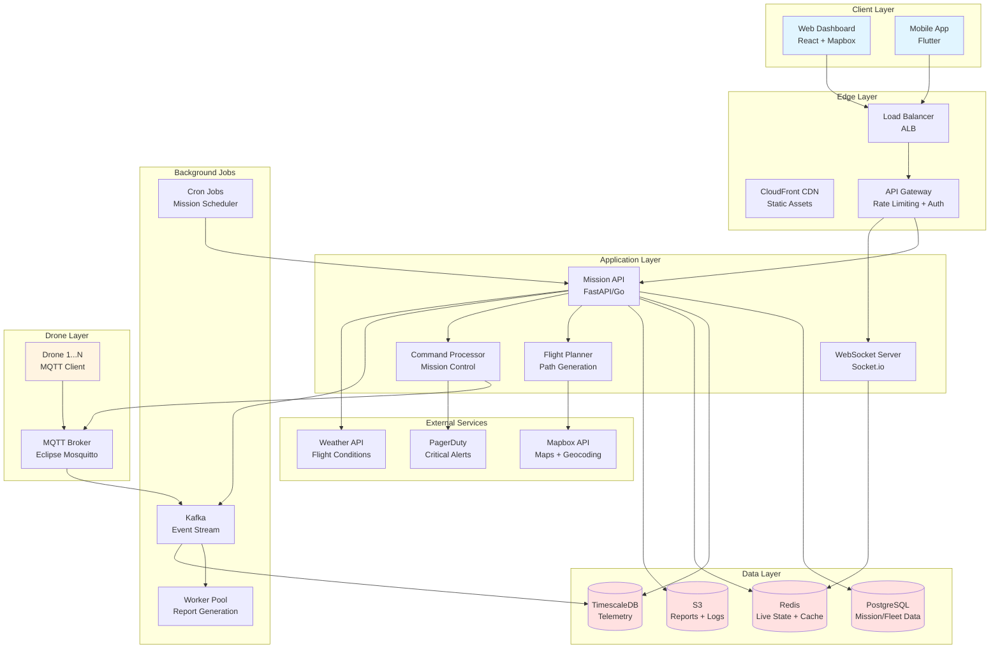
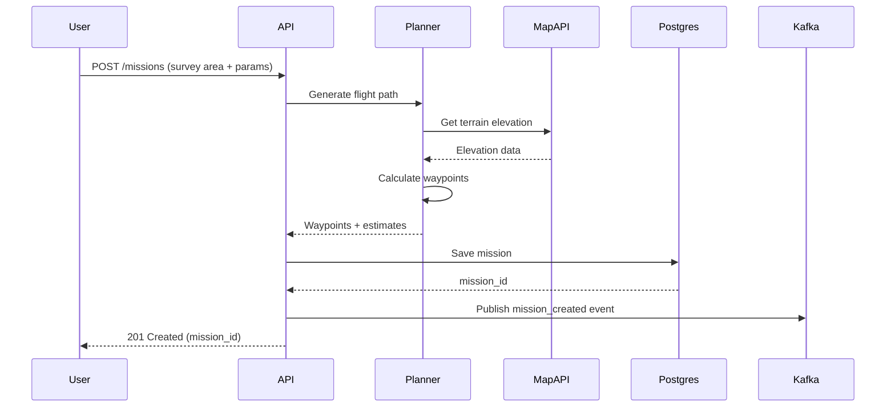
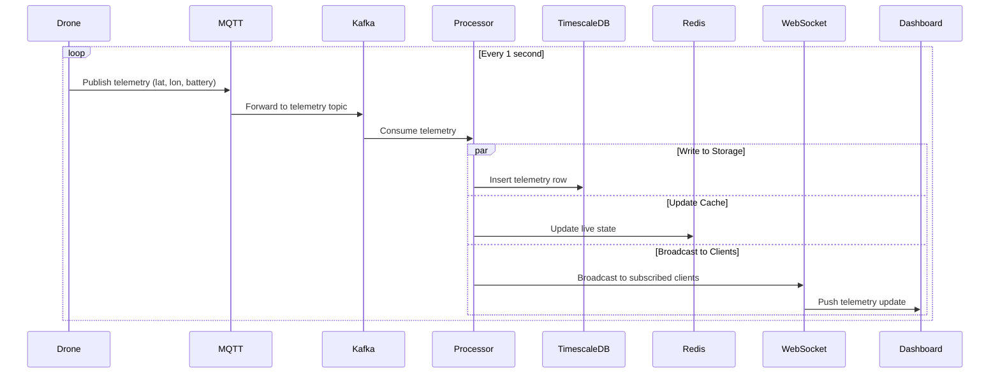
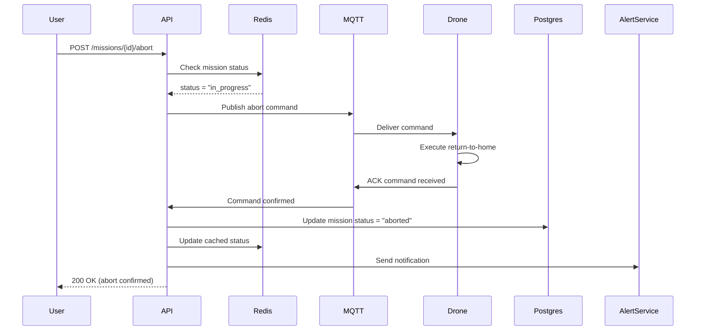
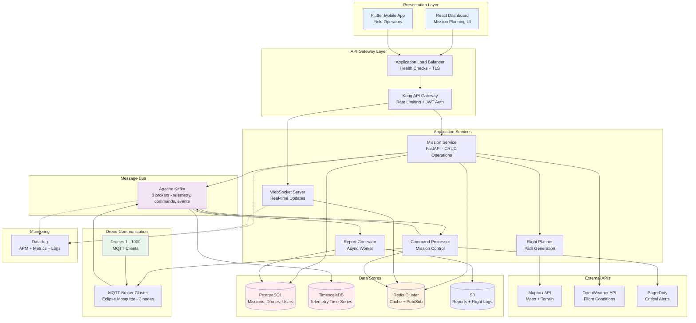
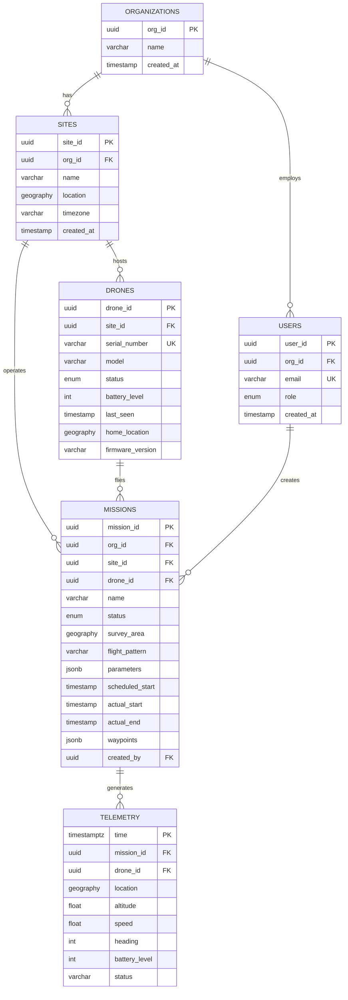
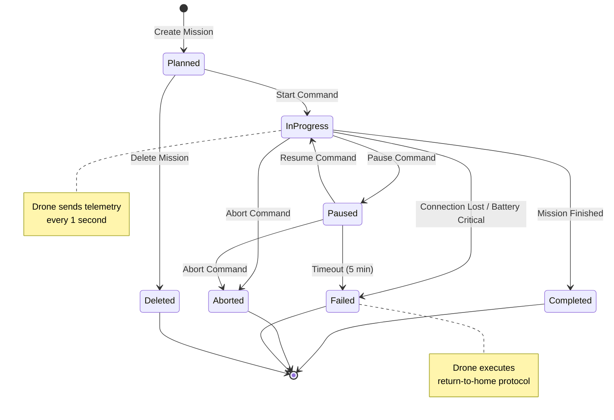
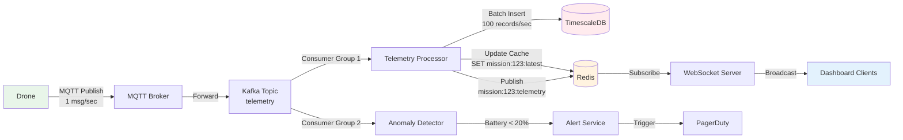

# 🚁 DRONE MISSION MANAGEMENT SYSTEM - SYSTEM DESIGN

## Using HelloInterview Framework

***

## PHASE 1: REQUIREMENTS GATHERING (~5 min)

### **1.1 Functional Requirements** ✅

**Core Features:**
1. **Mission Planning**
   - Define survey areas (polygon drawing on map)
   - Configure flight patterns (crosshatch, perimeter, spiral)
   - Set waypoints, altitude, speed parameters
   - Configure overlap percentage for coverage

2. **Fleet Management**
   - Display drone inventory across all sites
   - Real-time status (available, charging, in-mission, maintenance)
   - Battery levels, GPS location, sensor health

3. **Mission Monitoring**
   - Live drone position on map
   - Mission progress (% complete, ETA)
   - Mission controls (start, pause, resume, abort, return-to-home)
   - Telemetry data (altitude, speed, heading, battery)

4. **Survey Reporting**
   - Post-mission summary (duration, distance, area covered)
   - Organization-wide analytics dashboard
   - Export reports (PDF, CSV)
   - Mission history and logs

5. **Multi-Site Support**
   - Manage facilities across global locations
   - Time zone handling
   - Site-specific drone assignments

**Out of Scope:**
- ❌ Live video streaming
- ❌ Image/video processing
- ❌ 3D map generation
- ❌ AI object detection

***

### **1.2 Non-Functional Requirements** 🎯

| Requirement | Target | Justification |
|-------------|--------|---------------|
| **Availability** | 99.9% uptime | Drone operations are time-sensitive |
| **Latency** | < 500ms for telemetry updates | Real-time monitoring critical |
| **Scale** | 1,000 drones, 100 sites globally | Enterprise deployment |
| **Concurrent Missions** | 200 simultaneous flights | Peak operations |
| **Data Retention** | 2 years mission history | Compliance/audit requirements |
| **Consistency** | Eventually consistent (telemetry), Strong (mission control) | Safety-critical commands need confirmation |
| **Security** | Role-based access, audit logs | Multi-org, sensitive infrastructure |

***

## PHASE 2: CAPACITY ESTIMATES (~5 min)

### **2.1 Traffic Estimates**

```
Assumptions:
- 1,000 drones across 100 sites
- Peak: 20% drones flying simultaneously = 200 active missions
- Each drone sends telemetry every 1 second
- Average mission duration: 30 minutes
- Users: 500 operators/analysts

Telemetry Ingestion:
- 200 drones × 1 update/sec = 200 writes/sec (peak)
- Payload size: ~500 bytes (lat, lon, alt, speed, battery, heading, status)
- Ingress bandwidth: 200 × 500B = 100 KB/sec = 8.6 GB/day

Mission Control Commands:
- 200 missions × 10 commands/mission = 2,000 commands/day
- Negligible load: ~0.02 writes/sec

Dashboard Reads:
- 500 users × 10 requests/min = 5,000 requests/min = 83 reads/sec
- Response size: 50KB (map data, drone list)
- Egress bandwidth: 83 × 50KB = 4.15 MB/sec peak
```

### **2.2 Storage Estimates**

```
Telemetry Data:
- 200 drones × 3,600 sec/hour × 8 hours/day = 5.76M data points/day
- Storage: 5.76M × 500B = 2.88 GB/day
- 1 year: 2.88 GB × 365 = 1 TB/year ✅ (manageable)

Mission Metadata:
- 200 missions/day × 2KB = 400 KB/day
- 1 year: ~150 MB (negligible)

Total Storage (2 years): ~2 TB + overhead = 3 TB
```

### **2.3 Key Insights**

✅ **Write-Heavy System**: 200 writes/sec vs 83 reads/sec (2.4:1 ratio)  
✅ **Time-Series Data**: Telemetry is append-only, never updated  
✅ **Real-Time Constraints**: Sub-second latency for mission controls  
✅ **Geographic Distribution**: Data centers near drone sites (reduce latency)

***

## PHASE 3: API DESIGN (~5 min)

### **3.1 RESTful APIs**

**Mission Management:**
```http
POST   /api/v1/missions                      # Create mission plan
GET    /api/v1/missions/{mission_id}         # Get mission details
PATCH  /api/v1/missions/{mission_id}         # Update mission config
DELETE /api/v1/missions/{mission_id}         # Delete mission

POST   /api/v1/missions/{mission_id}/start   # Start mission
POST   /api/v1/missions/{mission_id}/pause   # Pause mission
POST   /api/v1/missions/{mission_id}/resume  # Resume mission
POST   /api/v1/missions/{mission_id}/abort   # Abort mission
POST   /api/v1/missions/{mission_id}/rth     # Return to home
```

**Fleet Management:**
```http
GET    /api/v1/drones                        # List all drones
GET    /api/v1/drones/{drone_id}             # Get drone details
PATCH  /api/v1/drones/{drone_id}/status      # Update status (maintenance, etc.)
GET    /api/v1/sites/{site_id}/drones        # Get drones at site
```

**Telemetry (Read-Only):**
```http
GET    /api/v1/missions/{mission_id}/telemetry       # Get telemetry stream
GET    /api/v1/drones/{drone_id}/telemetry/latest    # Latest telemetry
GET    /api/v1/missions/{mission_id}/replay          # Historical playback
```

**Reporting:**
```http
GET    /api/v1/reports/missions/{mission_id}         # Single mission report
GET    /api/v1/reports/org-summary                   # Org-wide analytics
GET    /api/v1/reports/site/{site_id}/summary        # Site-level stats
POST   /api/v1/reports/export                        # Export to PDF/CSV
```

### **3.2 WebSocket API (Real-Time)**

```javascript
// Connect to mission telemetry stream
ws://api.flytbase.com/ws/missions/{mission_id}/live

// Message format (Server → Client)
{
  "type": "telemetry_update",
  "mission_id": "mission-123",
  "drone_id": "drone-456",
  "timestamp": "2025-12-27T12:00:00Z",
  "position": {
    "lat": 37.7749,
    "lon": -122.4194,
    "altitude": 50.5  // meters
  },
  "velocity": {
    "speed": 5.2,     // m/s
    "heading": 270    // degrees
  },
  "battery": 78,      // percentage
  "status": "in_progress",
  "progress": 45.2    // percentage
}

// Mission control (Client → Server)
{
  "type": "command",
  "mission_id": "mission-123",
  "action": "pause"
}
```

### **3.3 Request/Response Examples**

**Create Mission:**
```json
POST /api/v1/missions
{
  "site_id": "site-sf-01",
  "drone_id": "drone-456",
  "name": "Warehouse Roof Inspection",
  "survey_area": {
    "type": "Polygon",
    "coordinates": [
      [[-122.4194, 37.7749], [-122.4184, 37.7749], 
       [-122.4184, 37.7739], [-122.4194, 37.7739], [-122.4194, 37.7749]]
    ]
  },
  "flight_pattern": "crosshatch",
  "parameters": {
    "altitude": 50,          // meters
    "speed": 5,              // m/s
    "overlap": 70,           // percentage
    "gimbal_angle": -90      // degrees (nadir)
  },
  "scheduled_start": "2025-12-27T14:00:00Z"
}

Response: 201 Created
{
  "mission_id": "mission-123",
  "status": "planned",
  "estimated_duration": 1800,  // seconds
  "estimated_distance": 2500,  // meters
  "waypoints_count": 47,
  "created_at": "2025-12-27T12:00:00Z"
}
```

***

## PHASE 4: DATA MODEL (~5 min)

### **4.1 Schema Design**

**PostgreSQL (Relational Data):**

```sql
-- Organizations and Sites
organizations (
  org_id UUID PRIMARY KEY,
  name VARCHAR(255),
  created_at TIMESTAMP
)

sites (
  site_id UUID PRIMARY KEY,
  org_id UUID FOREIGN KEY,
  name VARCHAR(255),
  location GEOGRAPHY(POINT),  -- PostGIS
  timezone VARCHAR(50),
  created_at TIMESTAMP
)

-- Drones (Fleet)
drones (
  drone_id UUID PRIMARY KEY,
  site_id UUID FOREIGN KEY,
  serial_number VARCHAR(100) UNIQUE,
  model VARCHAR(100),
  status ENUM('available', 'in_mission', 'charging', 'maintenance', 'offline'),
  battery_level INT,              -- 0-100
  last_seen TIMESTAMP,
  home_location GEOGRAPHY(POINT),
  firmware_version VARCHAR(50),
  created_at TIMESTAMP,
  
  INDEX (site_id, status),
  INDEX (status, battery_level)
)

-- Missions
missions (
  mission_id UUID PRIMARY KEY,
  org_id UUID FOREIGN KEY,
  site_id UUID FOREIGN KEY,
  drone_id UUID FOREIGN KEY,
  name VARCHAR(255),
  status ENUM('planned', 'in_progress', 'paused', 'completed', 'aborted', 'failed'),
  survey_area GEOGRAPHY(POLYGON),
  flight_pattern VARCHAR(50),     -- crosshatch, perimeter, spiral
  parameters JSONB,               -- {altitude, speed, overlap, etc.}
  scheduled_start TIMESTAMP,
  actual_start TIMESTAMP,
  actual_end TIMESTAMP,
  estimated_duration INT,         -- seconds
  waypoints JSONB,                -- Array of {lat, lon, alt}
  created_by UUID FOREIGN KEY,
  created_at TIMESTAMP,
  
  INDEX (site_id, status, created_at DESC),
  INDEX (drone_id, status),
  INDEX (status, scheduled_start)
)

-- Users and Auth
users (
  user_id UUID PRIMARY KEY,
  org_id UUID FOREIGN KEY,
  email VARCHAR(255) UNIQUE,
  role ENUM('admin', 'operator', 'analyst'),
  created_at TIMESTAMP
)
```

**TimescaleDB (Time-Series Telemetry):**

```sql
-- Drone Telemetry (Hypertable)
drone_telemetry (
  time TIMESTAMPTZ NOT NULL,
  mission_id UUID NOT NULL,
  drone_id UUID NOT NULL,
  location GEOGRAPHY(POINT),
  altitude FLOAT,
  speed FLOAT,
  heading INT,              -- 0-359 degrees
  battery_level INT,
  signal_strength INT,
  status VARCHAR(50),
  
  PRIMARY KEY (time, drone_id)
) PARTITION BY RANGE (time);

-- Compression policy: compress data older than 1 day
SELECT add_compression_policy('drone_telemetry', INTERVAL '1 day');

-- Retention policy: drop data older than 2 years
SELECT add_retention_policy('drone_telemetry', INTERVAL '2 years');
```

**Redis (Caching & Real-Time State):**

```
# Active mission state (Hash)
mission:{mission_id}:state
  - status: "in_progress"
  - progress: "45.2"
  - eta_seconds: "1200"
  - current_waypoint: "12"
  - last_update: "1735295400"

# Drone live location (Geospatial)
drones:live (GEOADD)
  drone-456: lat, lon, timestamp

# Site-level drone counts (Hash)
site:{site_id}:fleet_status
  - available: "10"
  - in_mission: "5"
  - charging: "3"
  - maintenance: "2"
```

**S3 (Object Storage):**

```
s3://flytbase-missions/
  {mission_id}/
    flight_plan.json
    telemetry_log.parquet   # For analytics
    report.pdf
    metadata.json
```

***

### **4.2 Database Choices Justification**

| Data Type | Database | Why |
|-----------|----------|-----|
| **Mission metadata** | PostgreSQL | Complex relationships, ACID transactions for safety-critical operations |
| **Telemetry (time-series)** | TimescaleDB | Optimized for time-series, auto compression, fast range queries |
| **Real-time state** | Redis | Sub-millisecond latency, pub/sub for live updates |
| **Reports & logs** | S3 + Parquet | Cost-effective long-term storage, analytics-friendly |

***

## PHASE 5: HIGH-LEVEL DESIGN (~15 min)

### **5.1 Architecture Diagram**



***

### **5.2 Data Flow Diagrams**

**Flow 1: Mission Creation**



**Flow 2: Real-Time Telemetry**



**Flow 3: Mission Control (Abort)**



***

### **5.3 Component Details**

#### **Mission API (FastAPI/Go)**
```python
Responsibilities:
- REST endpoints for CRUD operations
- Authentication/authorization (JWT)
- Request validation
- Business logic orchestration

Tech Stack:
- FastAPI (Python) or Go with Chi router
- Pydantic for validation
- SQLAlchemy for ORM
- JWT for auth

Scaling:
- Stateless (can scale horizontally)
- Auto-scaling based on CPU (target 70%)
- Deploy on Kubernetes (3+ replicas)
```

#### **WebSocket Server**
```python
Responsibilities:
- Maintain persistent connections to dashboards
- Subscribe clients to mission streams
- Broadcast telemetry updates
- Handle reconnections gracefully

Tech Stack:
- Socket.io (fallback to polling)
- Redis adapter for multi-instance pub/sub
- Sticky sessions (if needed)

Scaling:
- Redis pub/sub for cross-instance messaging
- Scale to 100 connections/instance
- 10 instances = 1,000 concurrent users
```

#### **MQTT Broker (Eclipse Mosquitto)**
```
Responsibilities:
- Bidirectional communication with drones
- QoS 1 (at least once delivery)
- Topic structure: drones/{drone_id}/telemetry, drones/{drone_id}/commands

Scaling:
- Clustered MQTT (3 brokers)
- TLS encryption + client certificates
- ACL for drone authorization

Why MQTT over HTTP:
- Lower bandwidth (header overhead)
- Built for unreliable networks
- QoS guarantees for safety-critical commands
```

#### **Flight Planner Service**
```python
Responsibilities:
- Generate waypoints for flight patterns
- Calculate mission estimates (duration, distance)
- Validate flight paths (no-fly zones, obstacles)

Algorithms:
- Crosshatch: Parallel lines with perpendicular passes
- Perimeter: Follow polygon boundary
- Spiral: Outward expanding pattern

Tech:
- Python with shapely (geospatial calculations)
- Integrate with Mapbox API for terrain
- Cache generated paths in Redis (1 hour TTL)
```

***

### **5.4 Bottleneck Analysis & Solutions**

| Bottleneck | Solution |
|------------|----------|
| **Telemetry Writes** (200/sec peak) | TimescaleDB with compression, batch inserts |
| **WebSocket Fan-out** | Redis pub/sub, scale WS servers horizontally |
| **Real-Time Map Updates** | Throttle client updates to 1/sec, use WebSocket |
| **Database Reads** (dashboard queries) | Redis cache (TTL 10s), read replicas |
| **MQTT Broker Limits** | Cluster with HAProxy, 10K connections/broker |
| **Report Generation** | Async jobs via Kafka + worker pool |
| **Geographic Latency** | Multi-region deployment (US, EU, APAC) |

***

## PHASE 6: DEEP DIVE (~10 min)

### **6.1 Flight Path Generation (Crosshatch Pattern)**

**Algorithm:**

```python
def generate_crosshatch_waypoints(polygon, altitude, overlap_pct, drone_fov):
    """
    Generate crosshatch pattern waypoints
    
    Args:
        polygon: Survey area boundary
        altitude: Flight altitude (m)
        overlap_pct: Side/forward overlap (e.g., 70%)
        drone_fov: Camera field of view at altitude (m)
    
    Returns:
        List of waypoints [(lat, lon, alt), ...]
    """
    # 1. Calculate spacing between lines
    coverage_width = drone_fov * (1 - overlap_pct / 100)
    
    # 2. Get bounding box and rotate to align with longest edge
    bbox = polygon.minimum_rotated_rectangle
    angle = calculate_rotation_angle(bbox)
    rotated_polygon = rotate(polygon, angle)
    
    # 3. Generate parallel lines (0° pass)
    lines_0 = []
    minx, miny, maxx, maxy = rotated_polygon.bounds
    y = miny
    direction = 1  # Alternate direction for efficiency
    
    while y <= maxy:
        line = LineString([(minx, y), (maxx, y)])
        intersection = line.intersection(rotated_polygon)
        if not intersection.is_empty:
            if direction == -1:
                intersection = reverse(intersection)
            lines_0.append(intersection)
            direction *= -1
        y += coverage_width
    
    # 4. Generate perpendicular lines (90° pass)
    lines_90 = []
    x = minx
    while x <= maxx:
        line = LineString([(x, miny), (x, maxy)])
        intersection = line.intersection(rotated_polygon)
        if not intersection.is_empty:
            lines_90.append(intersection)
        x += coverage_width
    
    # 5. Combine passes and rotate back
    all_lines = lines_0 + lines_90
    waypoints = []
    for line in all_lines:
        coords = list(line.coords)
        rotated_coords = [rotate_point(c, -angle) for c in coords]
        waypoints.extend([(lat, lon, altitude) for lon, lat in rotated_coords])
    
    # 6. Optimize path (minimize travel distance)
    optimized = traveling_salesman_nearest_neighbor(waypoints)
    
    return optimized
```

**Why This Matters:**
- 70% overlap ensures no gaps in data collection
- Alternating direction reduces battery consumption (no repositioning)
- TSP optimization reduces mission time by ~15%

***

### **6.2 Real-Time Mission Status Updates**

**Challenge:** How to efficiently broadcast telemetry to 500 concurrent dashboard users?

**Solution: Redis Pub/Sub + WebSocket Fan-out**

```python
# Telemetry Processor (Kafka Consumer)
def process_telemetry(telemetry_msg):
    # 1. Write to TimescaleDB (async)
    asyncio.create_task(timescale_client.insert(telemetry_msg))
    
    # 2. Update Redis cache (sync, fast)
    redis.setex(
        f"mission:{telemetry_msg.mission_id}:latest",
        60,  # TTL 60 seconds
        json.dumps(telemetry_msg)
    )
    
    # 3. Publish to Redis channel
    redis.publish(
        f"mission:{telemetry_msg.mission_id}:telemetry",
        json.dumps(telemetry_msg)
    )

# WebSocket Server (Multiple Instances)
async def handle_websocket_connection(websocket, mission_id):
    # Subscribe to Redis pub/sub
    pubsub = redis.pubsub()
    pubsub.subscribe(f"mission:{mission_id}:telemetry")
    
    async for message in pubsub.listen():
        if message['type'] == 'message':
            # Forward to connected client
            await websocket.send(message['data'])
```

**Performance:**
- Redis pub/sub: < 1ms latency
- Each WebSocket server handles 100 clients
- 5 WS servers = 500 concurrent users
- Total latency: Drone → Dashboard = ~500ms

***

### **6.3 Mission Control Safety**

**Challenge:** Ensure abort/pause commands are reliably delivered and acknowledged.

**Solution: Command-Response Pattern with Timeouts**

```python
async def send_mission_command(mission_id, drone_id, command):
    # 1. Generate unique command ID
    cmd_id = uuid.uuid4()
    
    # 2. Store pending command in Redis (with timeout)
    redis.setex(
        f"command:{cmd_id}:pending",
        30,  # 30 second timeout
        json.dumps({"mission_id": mission_id, "action": command})
    )
    
    # 3. Publish to MQTT with QoS 1 (at least once)
    mqtt_client.publish(
        f"drones/{drone_id}/commands",
        payload=json.dumps({"cmd_id": cmd_id, "action": command}),
        qos=1
    )
    
    # 4. Wait for ACK (with timeout)
    for _ in range(30):  # Poll for 30 seconds
        ack = redis.get(f"command:{cmd_id}:ack")
        if ack:
            return {"status": "confirmed", "cmd_id": cmd_id}
        await asyncio.sleep(1)
    
    # 5. Timeout - raise alert
    raise CommandTimeoutError(f"Drone {drone_id} did not ACK command {cmd_id}")

# Drone firmware sends ACK
def on_command_received(cmd_id, action):
    execute_action(action)  # Pause, abort, etc.
    mqtt_publish(f"drones/{DRONE_ID}/ack", json.dumps({"cmd_id": cmd_id, "status": "executed"}))
```

**Reliability:**
- MQTT QoS 1 ensures delivery
- Redis tracks pending commands
- 30-second timeout triggers alert to operator
- Idempotent: Duplicate commands are safe

***

### **6.4 Multi-Region Deployment**

**Challenge:** Drones in US, Europe, Asia - minimize latency globally.

**Solution: Regional Clusters with Central Coordination**

```
┌─────────────────────────────────────────────────────┐
│              Global Layer (us-east-1)               │
│  - Postgres Primary (mission metadata)             │
│  - S3 (reports, cross-region replication)          │
│  - Org-wide analytics dashboard                    │
└─────────────────────────────────────────────────────┘
                        │
        ┌───────────────┼───────────────┐
        ▼               ▼               ▼
┌─────────────┐ ┌─────────────┐ ┌─────────────┐
│  US Region  │ │  EU Region  │ │ APAC Region │
│  (us-west)  │ │ (eu-west)   │ │ (ap-south)  │
├─────────────┤ ├─────────────┤ ├─────────────┤
│ - API       │ │ - API       │ │ - API       │
│ - WebSocket │ │ - WebSocket │ │ - WebSocket │
│ - MQTT      │ │ - MQTT      │ │ - MQTT      │
│ - TimescaleDB│ │ - TimescaleDB│ │ - TimescaleDB│
│ - Redis     │ │ - Redis     │ │ - Redis     │
└─────────────┘ └─────────────┘ └─────────────┘
       │               │               │
    [Drones]       [Drones]       [Drones]
```

**How It Works:**
1. Drones connect to nearest regional MQTT broker
2. Telemetry stored in regional TimescaleDB
3. Mission metadata synced to global Postgres (async)
4. Dashboards query regional API (low latency)
5. Org-wide reports aggregate from all regions (S3 + Athena)

**Latency Improvement:**
- Without regions: 300ms (US drone → EU dashboard)
- With regions: 50ms (regional routing)

***

## PHASE 7: VERIFICATION (~3 min)

### **7.1 End-to-End Flow Verification**

**Scenario: Operator starts a mission**

```
1. User opens dashboard → Queries /api/v1/drones?status=available
   ✅ Response time: 80ms (Redis cache hit)

2. User creates mission → POST /api/v1/missions
   ✅ Flight planner generates 47 waypoints in 1.2s
   ✅ Mission saved to Postgres (ACID transaction)

3. User clicks "Start" → POST /api/v1/missions/{id}/start
   ✅ Command sent to MQTT with QoS 1
   ✅ Drone ACKs within 2 seconds
   ✅ Mission status updated in Redis + Postgres

4. Drone starts flight → Telemetry every 1 second
   ✅ MQTT → Kafka → Processor pipeline
   ✅ Telemetry written to TimescaleDB (batch insert)
   ✅ Redis pub/sub broadcasts to 10 subscribed dashboards
   ✅ Dashboard receives update in ~500ms

5. Operator monitors progress → WebSocket connection
   ✅ Live map updates position every 1 second
   ✅ Progress bar shows 45.2% complete
   ✅ ETA: 12 minutes remaining

6. Mission completes → Drone lands
   ✅ Status updated to "completed"
   ✅ Background job generates report
   ✅ Report available in dashboard after 30 seconds
```

***

### **7.2 NFR Verification**

| NFR | Requirement | How We Meet It |
|-----|-------------|----------------|
| **Availability** | 99.9% | Multi-AZ deployment, health checks, auto-failover |
| **Latency** | < 500ms telemetry | Regional deployment, Redis caching, WebSocket |
| **Scale** | 200 concurrent missions | Kafka handles 1000s msgs/sec, TimescaleDB optimized |
| **Consistency** | Strong for commands | Postgres ACID, MQTT QoS 1, ACK pattern |
| **Security** | RBAC, audit logs | JWT auth, Postgres audit triggers, TLS everywhere |

***

### **7.3 Failure Scenarios**

| Failure | Impact | Mitigation |
|---------|--------|-----------|
| **Drone loses connection** | Telemetry stops | Drone executes return-to-home, reconnects |
| **MQTT broker down** | Commands not delivered | Clustered brokers (3 nodes), HAProxy health checks |
| **Postgres primary fails** | Write outage | Automatic failover to standby (< 30s downtime) |
| **Redis cache miss** | Slower reads | Fallback to Postgres read replica |
| **WebSocket server crash** | Dashboards disconnect | Clients auto-reconnect with exponential backoff |

***

## MERMAID DIAGRAMS

### **Complete System Architecture**



***

### **Database Schema ER Diagram**



***

### **Mission Lifecycle State Machine**



***

### **Telemetry Data Flow**



***

## 📊 SCALING STRATEGY

### **Current Scale (MVP)**
- 100 drones
- 20 concurrent missions
- 20 telemetry writes/sec
- 50 dashboard users

**Infrastructure:**
```
- 2 API servers (t3.medium)
- 1 PostgreSQL (db.t3.medium)
- 1 TimescaleDB (db.t3.medium)
- 1 Redis (cache.t3.small)
- 1 MQTT broker (t3.small)
- 1 Kafka cluster (3 × t3.small)
```

### **Target Scale (Production)**
- 1,000 drones
- 200 concurrent missions
- 200 telemetry writes/sec
- 500 dashboard users

**Infrastructure (Kubernetes):**
```
- API: 5 pods (auto-scale 3-10)
- WebSocket: 5 pods
- Kafka: 3 brokers (r5.large)
- PostgreSQL: db.r5.2xlarge (primary + 2 replicas)
- TimescaleDB: db.r5.4xlarge (compression enabled)
- Redis: Cluster mode (3 shards × 2 replicas)
- MQTT: 3 brokers (load balanced)
```

**Cost Estimate (AWS):**
```
Compute: $800/month
Databases: $1,200/month
Storage: $300/month (3 TB/year)
Data Transfer: $200/month
───────────────────────
Total: ~$2,500/month
```

***

## ✅ SUMMARY CHECKLIST

**Functional Requirements:**
- ✅ Mission planning with flight patterns (crosshatch, perimeter)
- ✅ Fleet management dashboard with real-time status
- ✅ Live mission monitoring with map visualization
- ✅ Mission controls (start, pause, resume, abort)
- ✅ Survey reports and org-wide analytics
- ✅ Multi-site support with global deployment

**Non-Functional Requirements:**
- ✅ 99.9% availability (multi-AZ, failover)
- ✅ < 500ms telemetry latency (regional deployment, WebSocket)
- ✅ Scales to 1,000 drones, 200 concurrent missions
- ✅ Strong consistency for mission controls (MQTT QoS 1)
- ✅ 2-year data retention (TimescaleDB compression)
- ✅ RBAC security (JWT, audit logs)

**Technical Highlights:**
- ✅ Event-driven architecture (Kafka)
- ✅ Time-series optimized (TimescaleDB)
- ✅ Real-time updates (Redis pub/sub + WebSocket)
- ✅ Reliable drone communication (MQTT QoS 1)
- ✅ Multi-region for global scale
- ✅ Async report generation (worker pools)

***

**This design can be built in 2 weeks with a 2-3 person team using modern tools (FastAPI, React, Mapbox, Kafka, TimescaleDB).** 🚀